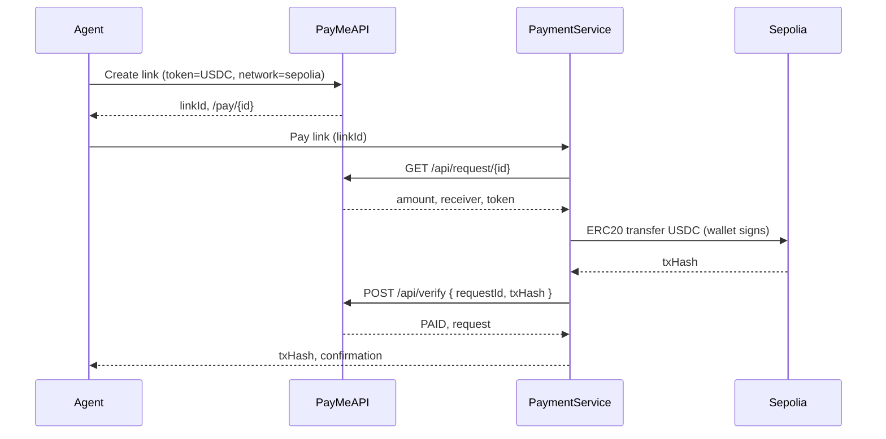

# Moltbook Agent + PayMe: Automated USDC Payments on Sepolia

## Goal

- An agent (on Moltbook / OpenClaw or any client) can **create** PayMe payment links.
- The same or another agent can **pay** a link automatically with **USDC on Sepolia** and get **tx hash + payment confirmation**.
- All flows use the existing PayMe platform; optional Moltbook identity for verified agent callers.

---

## Architecture (high level)

- **PayMe API**: Existing backend ([backend/server.js](backend/server.js), [backend/controllers/paymentController.js](backend/controllers/paymentController.js)) — create link, get request (402 with payment details), verify (on-chain). Optionally verify Moltbook identity on selected routes.
- **Agent payment service**: New component that holds a **Sepolia wallet** (private key in env), calls PayMe to get payment details, sends USDC via ethers/viem, then calls verify and returns **tx hash + confirmation** to the agent.
- **Moltbook**: Agent gets identity token; PayMe (or the payment service) can verify `X-Moltbook-Identity` for audit/rate-limiting (optional).
- **OpenClaw**: Optional skill + plugin so the agent has tools like `payme_create_link` and `payme_pay_link` that call the payment service or PayMe API.

---

## Research summary

| Topic | Finding |

|-------|--------|

| **Moltbook** | Identity layer for AI agents. Bots get short-lived identity tokens; apps verify via `POST https://moltbook.com/api/v1/agents/verify-identity` with `X-Moltbook-App-Key`. No built-in wallet; agents need an external way to hold/sign (e.g. your payment service). |

| **OpenClaw (molt.bot)** | Agent runtime with workspace, skills (SKILL.md), and plugins. Plugins can register **agent tools** (JSON-schema) so the LLM can call e.g. `payme_pay_link(linkId)`. Tools can call your HTTP API or a local script. |

| **PayMe create** | `POST /api/create` with `token`, `amount`, `receiver`, `network`, `expiresInDays`, `creatorWallet`. Use `network: "sepolia"` and `token: "USDC"` for agent flows. |

| **PayMe verify** | Full Express backend runs **on-chain verification** ([backend/lib/blockchain.js](backend/lib/blockchain.js)) for `POST /api/verify`. Vercel serverless ([backend/api/index.js](backend/api/index.js)) currently **does not** verify on-chain — it only marks PAID. So for production agent use, either use the full backend or add blockchain verification to the serverless handler. |

| **USDC Sepolia** | Frontend uses [src/lib/contracts.ts](src/lib/contracts.ts) (e.g. `USDC_ADDRESSES.sepolia`). Backend uses `process.env.NEXT_PUBLIC_USDC_ADDRESS` (or Sepolia default). Same contract for agent: Sepolia USDC address + ERC20 `transfer`. |

---

## Implementation plan

### 1. PayMe backend: agent-ready API and verify

- **Normalize network value**: Ensure create/verify consistently accept `sepolia` (backend store already uses `network || 'sepolia'`; [backend/api/index.js](backend/api/index.js) uses `'Sepolia (ETH Testnet)'`). Standardize on `sepolia` for API contracts so the agent and payment service always send `network: "sepolia"`.
- **Optional Moltbook auth**: Add middleware that, when `MOLTBOOK_APP_KEY` is set, verifies `X-Moltbook-Identity` on selected routes (e.g. `/api/create`, or a dedicated agent route). On success, attach `req.moltbookAgent`; on missing/invalid token return 401. Use audience (e.g. your API domain) when verifying. Document that agents should get a token from Moltbook and send it with requests.
- **Serverless verify**: If you deploy the API on Vercel ([backend/api/index.js](backend/api/index.js)), add the same on-chain verification logic as in [backend/controllers/paymentController.js](backend/controllers/paymentController.js) (load request, resolve USDC address for Sepolia, call `verifyTransaction` from [backend/lib/blockchain.js](backend/lib/blockchain.js)), then mark PAID only when verification succeeds. Otherwise agents could mark links PAID without a real tx.

### 2. Agent payment service (create link + pay with USDC, return tx hash)

- **New repo or folder** (e.g. `agent-payment-service/` or separate repo): Small Node (or Python) service that:
  - **Env**: `PAYME_API_URL`, `SEPOLIA_RPC_URL`, `AGENT_WALLET_PRIVATE_KEY`, `MOLTBOOK_APP_KEY` (optional), Sepolia USDC contract address (or use PayMe’s default).
  - **Create link**: `POST {PAYME_API_URL}/api/create` with body `{ token: "USDC", amount, receiver, network: "sepolia", expiresInDays, creatorWallet }`. Return `linkId`, `link` (e.g. `/r/{id}`), full URL if needed.
  - **Get payment details**: `GET {PAYME_API_URL}/api/request/:id`. Parse 402/200; from 402 body get `amount`, `receiver`, `token`, `network`.
  - **Pay link**: (a) GET payment details; (b) build ERC20 `transfer(receiver, amountInWei)` (USDC 6 decimals); (c) sign and send via ethers v6 or viem using `AGENT_WALLET_PRIVATE_KEY` and Sepolia RPC; (d) get `txHash`; (e) `POST {PAYME_API_URL}/api/verify` with `{ requestId, txHash }`; (f) return `{ success, txHash, request, verification }` as payment confirmation.
  - **Optional**: Require `X-Moltbook-Identity` and verify with Moltbook before performing pay (so only verified agents can trigger payments).
- **Security**: Never log or expose private key; run in a secure env (e.g. server or trusted runtime). Optionally rate-limit by Moltbook agent id or IP.

### 3. Moltbook identity (optional) on PayMe

- **Backend**: If `MOLTBOOK_APP_KEY` is set, add middleware that:
  - Reads `X-Moltbook-Identity` (or configurable header).
  - Calls `POST https://moltbook.com/api/v1/agents/verify-identity` with `X-Moltbook-App-Key` and body `{ token, audience: YOUR_DOMAIN }`.
  - On success: set `req.moltbookAgent = data.agent`, next(). On failure: 401 with clear error (e.g. `identity_token_expired`).
- **Apply** to routes that the agent will call (e.g. `POST /api/create`, `GET /api/request/:id`, `POST /api/verify`) or to a dedicated `/api/agent/*` namespace. Document auth in API docs and in the agent skill (e.g. link to `https://moltbook.com/auth.md?app=PayMe&endpoint=...`).

### 4. OpenClaw skill + plugin (optional)

- **Skill (SKILL.md)**: Under `~/.openclaw/skills/payme/` or workspace `skills/payme/`:
  - YAML frontmatter: `name`, `description` (e.g. create PayMe links and pay with USDC on Sepolia; returns link or tx hash and confirmation).
  - Instructions: how to use the PayMe agent tools (create link, pay link); auth: send `X-Moltbook-Identity` (and link to Moltbook auth instructions if PayMe uses Moltbook).
  - Gating: e.g. `requires.env: ["PAYME_AGENT_SERVICE_URL"]` or plugin-provided config.
- **Plugin (OpenClaw)**: Small plugin that registers two agent tools:
  - `payme_create_link`: params e.g. `amount`, `receiver`, `description?`, `expiresInDays?`; calls payment service or PayMe API to create link; returns `linkId`, full URL.
  - `payme_pay_link`: params `linkId`; calls payment service “pay link”; returns `txHash`, confirmation (and optionally explorer link).
  - Plugin can call the **agent payment service** HTTP API (so the wallet stays in the service, not in the OpenClaw process). Alternatively, plugin could call PayMe API directly for create/get and only “pay” via the service that holds the key.
- **Config**: In `openclaw.json`, set `skills.entries.payme.enabled: true` and env (e.g. `PAYME_AGENT_SERVICE_URL`, optional `MOLTBOOK_API_KEY` for the agent to get identity tokens).

### 5. End-to-end flow and docs

- **Flow**: Agent (with Moltbook identity) → Payment service or PayMe API (create link) → share link; another or same agent → Payment service (pay link) → service sends USDC on Sepolia → verify with PayMe → return tx hash and confirmation to agent.
- **Docs**: Add a short “Agent integration” section (e.g. in [README.md](README.md) or `docs/agents.md`) describing: PayMe base URL, create/verify semantics, optional Moltbook header; link to Moltbook auth instructions; that “pay automatically” is done via the agent payment service (and optionally OpenClaw skill).

---

## To-do list (actionable)

| # | Task | Owner / Notes |

|---|------|----------------|

| 1 | Standardize `network` to `sepolia` in PayMe API (create + serverless if used) and document it for agents. | Backend |

| 2 | Add optional Moltbook identity middleware (verify `X-Moltbook-Identity`) and protect selected API routes when `MOLTBOOK_APP_KEY` is set. | Backend |

| 3 | Add on-chain verification to Vercel serverless `POST /api/verify` (reuse `blockchain.verifyTransaction` and request lookup) if you deploy API on Vercel. | Backend |

| 4 | Create agent payment service: env (PayMe URL, Sepolia RPC, wallet PK, USDC address), endpoints or functions for create link, get payment details, pay link (ERC20 transfer + verify), return tx hash and confirmation. | New service |

| 5 | Optionally require Moltbook identity in the payment service for “pay link” and document how agents obtain and send the token. | New service |

| 6 | Write OpenClaw skill (SKILL.md) describing PayMe agent capabilities and auth. | OpenClaw |

| 7 | Implement OpenClaw plugin that registers `payme_create_link` and `payme_pay_link` tools calling the payment service (or PayMe + payment service). | OpenClaw |

| 8 | Document agent integration: PayMe API usage, Moltbook auth, payment service role, and OpenClaw setup in README or docs/agents.md. | Docs |

---

## Clarifications (recommended)

- **“Pay automatically to each other”**: Confirm whether you mean (a) one agent that can both create and pay (e.g. Agent A creates, Agent B pays, or same agent does both), or (b) multiple agents in a mesh each with their own wallet. The plan above assumes a single payment service wallet for “pay link”; multi-wallet would require multiple keys or a key-per-agent mapping.
- **Where the agent runs**: OpenClaw (molt.bot) with a plugin + skill, or a different runtime that only uses Moltbook for identity and calls your payment service/API directly. The plan supports both; the payment service is the core piece for automated USDC payment and confirmation.

---

## Files to add or change (summary)

- **Backend**: [backend/server.js](backend/server.js) (Moltbook middleware, route wiring), [backend/api/index.js](backend/api/index.js) (on-chain verify + optional Moltbook), [backend/controllers/paymentController.js](backend/controllers/paymentController.js) (no change if verify stays as-is).
- **New**: Agent payment service (new directory or repo): HTTP or CLI that creates link, gets details, sends USDC on Sepolia, verifies, returns tx hash and confirmation.
- **OpenClaw**: New skill folder (e.g. `payme/SKILL.md`) and plugin that registers `payme_create_link` and `payme_pay_link`.
- **Docs**: README or `docs/agents.md` with agent integration and Moltbook auth instructions.